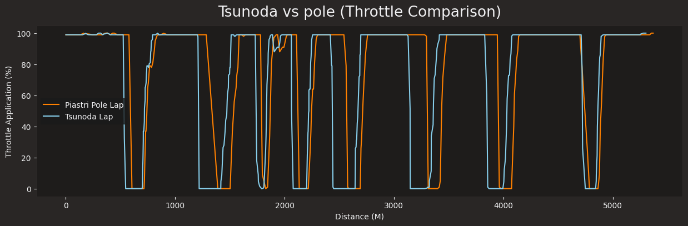

# Data Report for Piastri's Pole Lap vs. Tsunoda's fastest lap

### I aim to compare the driving style and investigating how Tsunoda could have made some time compared to Piastri's Pole Lap

For context: 
 - Data is taken from 2025 Bahrain Qualifying
 - Reports say that the Red Bull car is extremely 'front-heavy' making it difficult to drive
 - This is only the 2nd time Tsunoda has driven in a Grand Prix in the Red Bull car after being promoted
 - The Mclaren Car is known to be the fastest car on the grid as of (12/04/2025)

## Driving Styles Comparison

