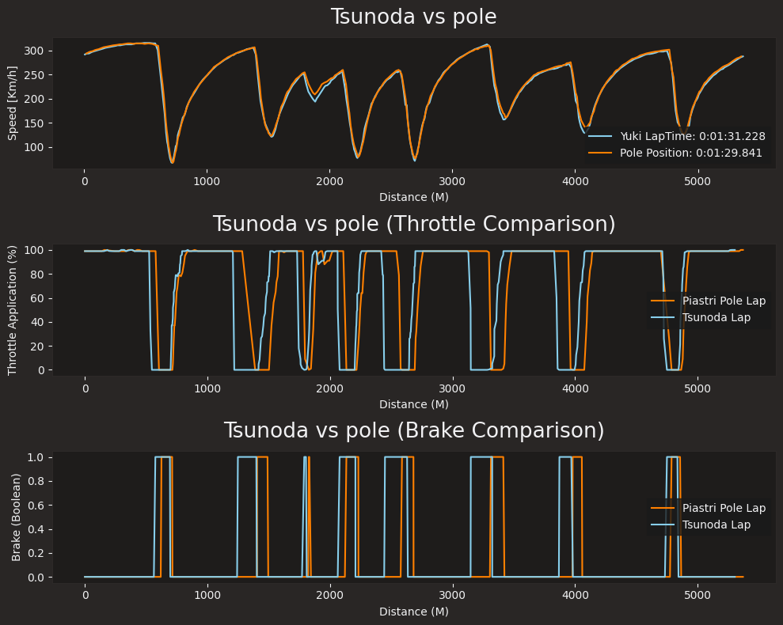
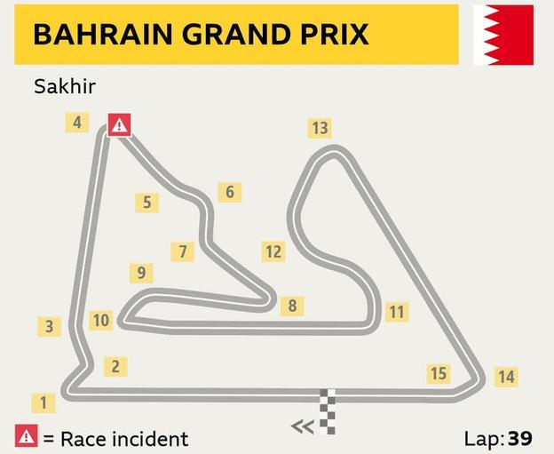

# Data Report for Piastri's Pole Lap vs. Tsunoda's fastest lap

### I aim to compare the driving style and investigating how Tsunoda could have made some time compared to Piastri's Pole Lap

For context: 
 - Data is taken from 2025 Bahrain Qualifying
 - Reports say that the Red Bull car is extremely 'front-heavy' making it difficult to drive
 - This is only the 2nd time Tsunoda has driven in a Grand Prix in the Red Bull car after being promoted
 - The Mclaren Car is known to be the fastest car on the grid as of (12/04/2025)
 - Tsunoda is known to have an aggresive driving style
 - While Piastri is known to have a smoother driving style 

## Driving Styles Comparison

- Tsunoda visibly brakes much earlier than Piastri, this suits the aggresive, heavier front end of the Red Bull
- This leads to Tsunoda getting on the throttle a bit earlier
- We can see the difference on the second slow corner clearly, which is turn 3.
- Tsunoda brakes for a longer time than piastri, and therefore is earlier on the throttle
- This could show how Tsunoda is changing to make the Red Bull Car more effective.

## Where has Tsunoda lost time?

On the fast right hander, just before the 2000m mark, Tsunoda seems to lift earlier than Piastri.

Observe turns 5, 6 and 7.
 (from the BBC)

Considering how the Red Bull car is 'front-heavy', and can carry high entry speeds, at a fast corner like this, by lifting earlier, you carry less speed into a corner, but have higher exit speed.

However the distance before turn 8 is quite short and Tsunoda will have to brake again, so in this case lifting early is worse than prioritising exit speed

Resulting in Piastri having a higher corner speed than Tsunoda just before the 2000m mark.